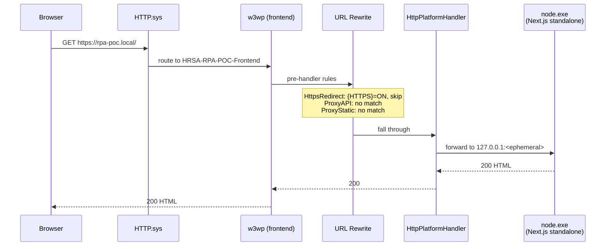
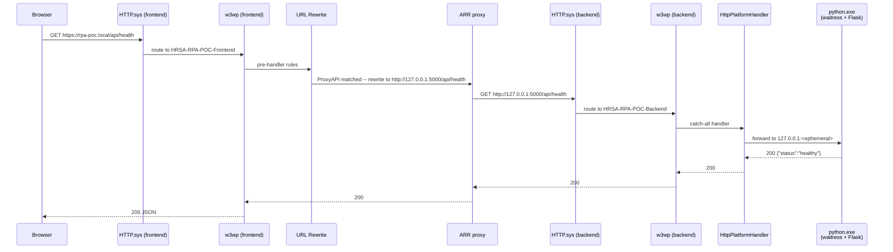
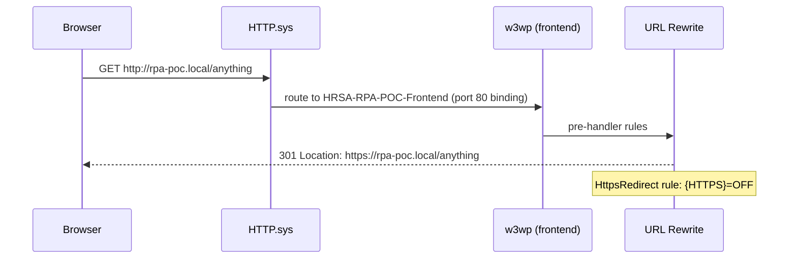

# IIS deployment architecture -- HRSA-RPA-POC

Topology, request flow, and operational reference for the IIS deployment
target. Companion doc to [README.md](README.md) (overview), [deploy-prod.ps1](deploy-prod.ps1) (the
deployer), and [octopus-runbook.md](octopus-runbook.md) (CI/CD wiring).

Diagrams are written in [Mermaid](https://mermaid.js.org/) and render natively
in GitHub. ASCII versions follow each one for terminal viewing.

---

## 1. Topology

One externally-facing site, one loopback-only site, two app pools. No cross-origin
calls -- browser hits a single hostname for both the SPA and the API.

```mermaid
flowchart LR
    classDef ext fill:#e8f4fd,stroke:#1f6fa9,color:#0b3d66
    classDef public fill:#fff4d6,stroke:#a07a00,color:#3a2a00
    classDef internal fill:#eef5e8,stroke:#3f7a25,color:#1c3811
    classDef worker fill:#f5e9f5,stroke:#7a3f7a,color:#3a1c3a
    classDef external fill:#ddd,stroke:#666,color:#222

    B[Browser]:::ext

    subgraph IIS [Windows Server / IIS]
        direction LR

        subgraph FE_Site [Site: HRSA-RPA-POC-Frontend]
            FB80[Binding: *:80 host=rpa-poc.local]
            FB443[Binding: *:443 host=rpa-poc.local SSL]
            FAP[AppPool: HRSA-RPA-POC-Frontend<br/>NoManagedCode<br/>ApplicationPoolIdentity]
            FW[w3wp.exe]
            FN[node.exe -- server.js<br/>via HttpPlatformHandler<br/>HOSTNAME=127.0.0.1<br/>PORT=$HTTP_PLATFORM_PORT]
            FB80 --> FAP
            FB443 --> FAP
            FAP --> FW
            FW -.spawns.-> FN
        end

        subgraph BE_Site [Site: HRSA-RPA-POC-Backend]
            BB[Binding: 127.0.0.1:5000 http only]
            BAP[AppPool: HRSA-RPA-POC-Backend<br/>NoManagedCode<br/>ApplicationPoolIdentity]
            BW[w3wp.exe]
            BPY[python.exe -m waitress app:app<br/>via HttpPlatformHandler<br/>listen=127.0.0.1:$HTTP_PLATFORM_PORT]
            BB --> BAP
            BAP --> BW
            BW -.spawns.-> BPY
        end

        FN -.no traffic in prod.-> BPY
    end

    AOA[Azure OpenAI]:::external

    B -- HTTPS rpa-poc.local --> FB443
    B -- HTTP rpa-poc.local --> FB80
    FB80 -. URL Rewrite: 301 to HTTPS .-> B
    FN -. ARR proxy /api/* /static/* .-> BB
    BPY --> AOA

    class FB80,FB443,FAP,FW,FN public
    class BB,BAP,BW,BPY internal
```



### ASCII fallback

```
                  +--------------------------------------------+
                  | Site: HRSA-RPA-POC-Frontend                |
                  | bindings: *:80, *:443 (host=rpa-poc.local) |
                  | pool: HRSA-RPA-POC-Frontend (NoManagedCode)|
   Browser  ----->|                                            |
   (HTTPS)        |    w3wp.exe                                |
                  |       |                                    |
                  |       | HPH spawns                         |
                  |       v                                    |
                  |    node.exe server.js                      |
                  |       HOSTNAME=127.0.0.1                   |
                  |       PORT=%HTTP_PLATFORM_PORT% (random)   |
                  |                                            |
                  |  URL Rewrite (runs BEFORE HPH for matches):|
                  |   .* on HTTP   -> 301 to HTTPS             |
                  |   /api/*       -> ARR proxy ---+           |
                  |   /static/*    -> ARR proxy ---+           |
                  +--------------------------------|-----------+
                                                   | loopback
                                                   v
                  +--------------------------------------------+
                  | Site: HRSA-RPA-POC-Backend                 |
                  | binding: 127.0.0.1:5000  (loopback only)   |
                  | pool: HRSA-RPA-POC-Backend (NoManagedCode) |
                  |                                            |
                  |    w3wp.exe                                |
                  |       |                                    |
                  |       | HPH spawns                         |
                  |       v                                    |
                  |    python.exe -m waitress app:app          |
                  |       --listen=127.0.0.1:                  |
                  |             %HTTP_PLATFORM_PORT% (random)  |
                  |       AZURE_OPENAI_API_KEY=<secret>        |
                  +-------------------|------------------------+
                                      | HTTPS
                                      v
                              +----------------+
                              |  Azure OpenAI  |
                              +----------------+
```

### Key properties

- **Same-origin in the browser.** Everything served from `https://rpa-poc.local/`. No CORS preflight, no cross-site cookies, no `Origin` headaches.
- **Backend not externally reachable.** The backend site binds to `127.0.0.1:5000` (IPv4 loopback). Even if the firewall opens 5000 to the LAN, HTTP.sys won't accept non-loopback traffic on that binding.
- **Two app pools** so the two runtimes recycle independently. Restarting the frontend doesn't kick anyone out of an in-flight `/api/upload` to the backend.
- **`NoManagedCode`** on both pools -- neither hosts .NET. Saves the CLR load cost.
- **`ApplicationPoolIdentity`** on both -- virtual accounts with no domain trust. `deploy-prod.ps1` grants them Modify on `DEPLOY_ROOT` and Read+Execute on the Python and Node install dirs via `icacls /T`.
- **HttpPlatformHandler manages both workers.** It launches Node and Python on random ephemeral loopback ports (`%HTTP_PLATFORM_PORT%`), proxies w3wp.exe traffic to them, and recycles them when the app pool recycles. We never call those ephemeral ports from outside.

---

## 2. Request flow

### 2a. Browser hits `/` (Next.js page)



### 2b. Browser hits `/api/health` (proxied to Flask)



`stopProcessing="true"` on the `ProxyAPI` rule means Next.js never sees this request -- the rewrite short-circuits the pipeline before HPH fires.

### 2c. Plain HTTP request (cleartext)



---

## 3. Process tree

After a request hits each site for the first time:

```
services.exe (PID 1)
+-- svchost.exe (W3SVC + WAS)
    +-- w3wp.exe  -ap "HRSA-RPA-POC-Frontend"          (PID NNNN)
    |   +-- node.exe .\server.js                       (PID NNNN+1)
    +-- w3wp.exe  -ap "HRSA-RPA-POC-Backend"           (PID NNNN+2)
        +-- python.exe -m waitress ... app:app         (PID NNNN+3)
```

- HTTP.sys (kernel) owns ports 80/443/5000 -- you'll see PID 4 (System) holding them in `netstat`. That's normal; HTTP.sys is the listener and dispatches into user-mode w3wp.
- HPH (the `httpPlatformHandler` IIS module loaded into w3wp.exe) is what actually spawns `node.exe` / `python.exe`. The child is a normal Win32 process under w3wp.
- On app pool recycle, HPH kills its child cleanly (SIGTERM equivalent on Windows) and starts a new one when the next request arrives.

---

## 4. CI/CD pipeline

```mermaid
flowchart LR
    subgraph ADO [Azure DevOps]
        BUILD[npm ci + next build<br/>pip download wheelhouse<br/>bundle templates + scripts]
        ZIP[Zip:<br/>HRSA-RPA-POC-iis-<v>.zip]
        BUILD --> ZIP
    end

    subgraph Oct [Octopus]
        SUB[Variable substitution:<br/>web.config.*.tpl<br/>deploy-prod.ps1]
        RUN[Run deploy-prod.ps1]
        ZIP --> SUB
        SUB --> RUN
    end

    subgraph IIS_Target [IIS Target Server]
        PRE[Preflight checks<br/>fail fast, no changes]
        SNAP[Snapshot current<br/>DEPLOY_ROOT -> .previous]
        COPY[Copy payload]
        VENV[Build venv from wheelhouse]
        CFG[Render Web.configs<br/>second-pass substitution]
        SITES[Configure app pools + sites<br/>grant ACLs<br/>stop Default Web Site]
        HEALTH[Health check loop<br/>5 min timeout]
        PRE --> SNAP --> COPY --> VENV --> CFG --> SITES --> HEALTH
    end

    RUN --> PRE
    HEALTH -- "exit 0/1/2/3" --> Oct
```



Exit codes (consumed by the Octopus runbook):

| Code | Meaning | Octopus action |
|---|---|---|
| 0 | Healthy | Pass release |
| 1 | Preflight failure | Fail loudly, nothing changed |
| 2 | Swap failed, auto-rolled-back to `.previous` | Investigate logs |
| 3 | Sites up but health check timed out | Alert on-call |

Mirrors the contract used by [../azure/bicep/deploy-prod.ps1](../azure/bicep/deploy-prod.ps1) for the Container Apps target.

---

## 5. Disk layout

```
C:\inetpub\HRSA-RPA-POC\                       <- DEPLOY_ROOT
+-- frontend\                                  <- Next.js standalone payload
|   +-- server.js
|   +-- .next\
|   |   +-- static\                            <- copied in by build-local.ps1
|   +-- public\                                <- copied in by build-local.ps1
|   +-- node_modules\                          <- bundled in standalone build
|   +-- logs\
|   |   +-- node-stdout_<pid>_<timestamp>.log  <- HPH-captured stdout
|   +-- Web.config                             <- rendered from web.config.frontend.tpl

+-- backend\                                   <- Flask app
|   +-- app.py
|   +-- controllers\
|   +-- services\
|   +-- ...                                    <- (uploads/, data/, database/ carried over from .previous snapshot)
|   +-- venv\                                  <- built on each deploy from wheelhouse
|   |   +-- Scripts\python.exe
|   +-- logs\
|   |   +-- waitress-stdout_<pid>_<timestamp>.log
|   +-- requirements.txt
|   +-- Web.config                             <- rendered from web.config.backend.tpl

+-- logs\                                      <- unused by HPH; kept for ad-hoc deploy logs

C:\inetpub\HRSA-RPA-POC.previous\              <- last-known-good snapshot
                                                  (auto-rollback target on swap failure)
```

The `uploads/`, `data/`, and `database/` subdirs are **carried over from `.previous`** on each deploy so user uploads and session state survive redeployments. Brand-new installs create them empty.

---

## 6. Reachability matrix

| From | To | Allowed? | Notes |
|---|---|---|---|
| Browser on the LAN | `https://rpa-poc.local/` (`*:443`) | Yes | Public ingress. |
| Browser on the LAN | `http://rpa-poc.local/` (`*:80`) | Yes -> 301 to HTTPS | URL Rewrite `HttpsRedirect` rule. |
| Browser on the LAN | `http://<server-ip>:5000/` | **No** | Backend bound to `127.0.0.1` only. HTTP.sys rejects. |
| Frontend `w3wp.exe` (ARR proxy) | `http://127.0.0.1:5000/api/...` | Yes | Loopback only. |
| Frontend `node.exe` | `http://127.0.0.1:5000/api/...` | Possible but unused | URL Rewrite catches `/api/*` before Node sees it. |
| Backend `python.exe` | Azure OpenAI (HTTPS, outbound) | Yes | Egress only. |
| Backend `python.exe` | Postgres / SQL (HTTPS, outbound) | Yes if `DATABASE_URL` set | Egress only. |
| Browser | HPH-assigned ephemeral ports (e.g. `:14108`) | Yes if firewall open | Should NOT be relied on -- port changes on every worker recycle. |

---

## 7. Port + binding map

| Port | Bound by | Binding | Reachable from | Purpose |
|---|---|---|---|---|
| 80 | HTTP.sys | `*:80:rpa-poc.local` -> HRSA-RPA-POC-Frontend | external | URL Rewrite 301 -> HTTPS |
| 443 | HTTP.sys | `*:443:rpa-poc.local` (SNI off, SSL cert by thumbprint) -> HRSA-RPA-POC-Frontend | external | Public ingress |
| 5000 | HTTP.sys | `127.0.0.1:5000:` -> HRSA-RPA-POC-Backend | loopback only | Backend ingress (ARR target) |
| ephemeral 49152-65535 | node.exe | bound by HPH on `127.0.0.1` | HPH only | Frontend worker |
| ephemeral 49152-65535 | python.exe (waitress) | bound by HPH on `127.0.0.1` | HPH only | Backend worker |

If you ever need to free port 5000 for something else, change `BACKEND_PORT` in
`local.env` (or the Octopus variable) -- both the IIS binding and the ARR
rewrite URL are templated from that single value.

---

## 8. Failure modes and where to look

Quick lookup table for things that have actually bitten this deployment.
See [octopus-runbook.md#troubleshooting](octopus-runbook.md#troubleshooting)
for the full list and [Diagnose.ps1](Diagnose.ps1) for the automated checks.

| Symptom | First place to look |
|---|---|
| HTTP 500.19 with `0x8007000d` | XML well-formedness of the rendered Web.config (`--` in a comment, malformed tag). `Diagnose.ps1` flags this explicitly. |
| HTTP 500.19 with `0x80070021` | Web.config uses a section locked at applicationHost level (`<serverRuntime>`, `<allowedServerVariables>`, etc). |
| HTTP 500 with no body, no stdout log | HPH can't exec the worker. Usually permissions on `python.exe` / `node.exe` install dir. `deploy-prod.ps1` grants these via `icacls /T`. |
| Both endpoints time out, w3wp running | Web.config token not substituted (HPH `processPath` is a literal `#{...}`). Diagnose checks this. |
| Browser shows IIS welcome page | Default Web Site is intercepting. `deploy-prod.ps1` stops it; set `KEEP_DEFAULT_SITE=1` only on shared boxes. |
| `400 Hostname` in `httperr1.log` for `::1:<port>` | A tool resolved `localhost` to IPv6 (`::1`); the backend is IPv4-only. Use `127.0.0.1` explicitly. |

---

## Cross-references

- [README.md](README.md) -- overview + recipe
- [deploy-prod.ps1](deploy-prod.ps1) -- the deployer this doc describes
- [web.config.frontend.tpl](web.config.frontend.tpl) / [web.config.backend.tpl](web.config.backend.tpl) -- what gets rendered into IIS
- [octopus-runbook.md](octopus-runbook.md) -- CI/CD project setup
- [Diagnose.ps1](Diagnose.ps1) -- automated check script that exercises every box on this diagram
- [../azure/bicep/DEPLOYMENT_TEST_LOG.md](../azure/bicep/DEPLOYMENT_TEST_LOG.md) -- parallel Container Apps target (different runtime, same Octopus pipeline contract)
